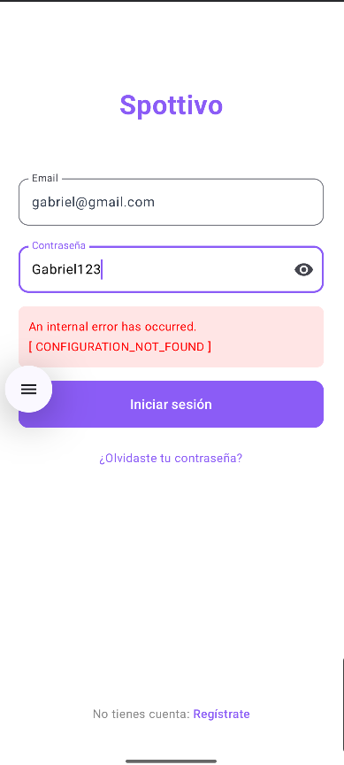

# 🚨 ERROR: "CONFIGURATION_NOT_FOUND" - SOLUCIÓN RÁPIDA

Si ves este error al intentar hacer login, es porque **Firebase Authentication NO está habilitado**.

### ✅ SOLUCIÓN (5 minutos):

1. **Abre Firebase Console**: https://console.firebase.google.com/project/spottivo-33658/authentication
2. **Haz clic en "Get Started"** (botón azul)
3. **En "Sign-in method", habilita "Email/Password"**:
   - Click en "Email/Password"
   - Activa el switch
   - Click en "Save"
4. **Habilita Firestore**: https://console.firebase.google.com/project/spottivo-33658/firestore
   - Click en "Create database"
   - Selecciona "Start in test mode"
   - Click en "Enable"
5. **Descarga el nuevo `google-services.json`**:
   - Ve a Project Settings > General
   - En "Your apps", descarga el `google-services.json` actualizado
   - Reemplázalo en `app/google-services.json`
   - **Rebuild** el proyecto en Android Studio

**Después de esto, tu app funcionará correctamente.**

---

# 🚀 GUÍA DE IMPLEMENTACIÓN COMPLETA - SPOTTIVO BACKEND

## ✅ LO QUE SE HA IMPLEMENTADO

### 📱 Android (Cliente)
1. **AuthRepository.kt** - Sistema seguro de autenticación con Firebase Auth
2. **LocationTrackingService.kt** - Servicio de ubicación en tiempo real (FindMy)
3. **MyFirebaseMessagingService.kt** - Notificaciones push
4. **ApiClient.kt** - Cliente REST para consumir el backend
5. **Friendship.kt** - Modelos de datos para amigos y ubicaciones

### ☁️ Firebase Backend (Servidor)
1. **API REST** - Endpoints para ubicaciones, amigos y hardware check
2. **Notificaciones automáticas** - Cuando un amigo se conecta
3. **Limpieza automática** - Elimina datos antiguos
4. **Monitor de inactividad** - Marca usuarios offline automáticamente

---

## 📋 PASOS PARA PONER EN MARCHA

### ⚠️ PASO 0: CONFIGURAR FIREBASE AUTHENTICATION (CRÍTICO)

**Este es el error que estás viendo: "CONFIGURATION_NOT_FOUND"**

1. Ve a la consola de Firebase: https://console.firebase.google.com/
2. Selecciona tu proyecto: **spottivo-33658**
3. En el menú lateral, haz clic en **"Authentication"** (Autenticación)
4. Haz clic en el botón **"Get Started"** o **"Comenzar"**
5. En la pestaña **"Sign-in method"**, habilita:
   - ✅ **Email/Password** (OBLIGATORIO)
   - Click en "Enable" y guarda
6. También ve a **"Firestore Database"**:
   - Click en "Create database"
   - Selecciona "Start in test mode" (por ahora)
   - Click en "Next" y "Enable"
7. **Firebase Storage** (para fotos de perfil):
   - Ve a https://console.firebase.google.com/project/spottivo-33658/storage
   - Click en "Get Started"
   - Selecciona "Start in test mode"
   - Click en "Done"

**Sin este paso, la app NO funcionará.** Este es el error que estás viendo.

---

### PASO 1: Instalar Node.js y Firebase CLI

```powershell
# 1. Descarga e instala Node.js desde: https://nodejs.org/ (versión 18 LTS)

# 2. Instala Firebase CLI
npm install -g firebase-tools

# 3. Inicia sesión en Firebase
firebase login
```

### PASO 2: Configurar el Backend

```powershell
# Ve a la carpeta del proyecto
cd c:\Users\OsoGa\StudioProjects\Spottivo\Spottivo-1

# Inicializa Firebase (si no lo has hecho)
firebase init

# Cuando te pregunte, selecciona:
# - Functions: Configure a Cloud Functions directory
# - Firestore: Configure security rules and indexes files
# - Use an existing project: Selecciona tu proyecto de Firebase

# Ve a la carpeta functions e instala dependencias
cd functions
npm install
```

### PASO 3: Desplegar el Backend

```powershell
# Desde la carpeta functions/, ejecuta:
firebase deploy --only functions

# Esto desplegará:
# ✓ api (REST API con hardware check)
# ✓ onUserStatusChange (notificaciones)
# ✓ cleanOldLocations (limpieza automática)
# ✓ markInactiveUsersOffline (detección de inactividad)
```

Una vez desplegado, verás una URL como:
```
https://us-central1-TU_PROJECT_ID.cloudfunctions.net/api
```

### PASO 4: Configurar la URL en Android

Abre el archivo:
```
app/src/main/java/com/example/spottivo/data/ApiClient.kt
```

Y cambia esta línea con tu Project ID real:
```kotlin
private const val BASE_URL = "https://us-central1-TU_PROJECT_ID.cloudfunctions.net/api/"
```

### PASO 5: Sincronizar Gradle

1. Abre Android Studio
2. Haz clic en "Sync Project with Gradle Files" (ícono de elefante)
3. Espera a que se descarguen las dependencias:
   - Firebase Messaging
   - Retrofit
   - Play Services Location

### PASO 6: Configurar Permisos en Runtime

En tu `MainActivity` o donde corresponda, pide los permisos de ubicación:

```kotlin
import android.Manifest
import androidx.activity.result.contract.ActivityResultContracts

class MainActivity : ComponentActivity() {
    
    private val locationPermissionRequest = registerForActivityResult(
        ActivityResultContracts.RequestMultiplePermissions()
    ) { permissions ->
        when {
            permissions.getOrDefault(Manifest.permission.ACCESS_FINE_LOCATION, false) -> {
                // Permiso concedido, inicia el servicio
                startLocationService()
            }
            else -> {
                // Permiso denegado
                Toast.makeText(this, "Se necesita permiso de ubicación", Toast.LENGTH_SHORT).show()
            }
        }
    }
    
    override fun onCreate(savedInstanceState: Bundle?) {
        super.onCreate(savedInstanceState)
        
        // Pedir permisos
        locationPermissionRequest.launch(arrayOf(
            Manifest.permission.ACCESS_FINE_LOCATION,
            Manifest.permission.ACCESS_COARSE_LOCATION,
            Manifest.permission.POST_NOTIFICATIONS
        ))
    }
    
    private fun startLocationService() {
        val intent = Intent(this, LocationTrackingService::class.java)
        if (Build.VERSION.SDK_INT >= Build.VERSION_CODES.O) {
            startForegroundService(intent)
        } else {
            startService(intent)
        }
    }
}
```

---

## 🎯 CÓMO USAR CADA FUNCIONALIDAD

### 1. LOGIN Y REGISTRO (Ya implementado en AuthRepository)

```kotlin
// En tu ViewModel o Activity:
val authRepository = AuthRepository()

// Registro
authRepository.registerUser("Juan", "juan@example.com", "password123")
    .collect { result ->
        when (result) {
            is AuthResult.Loading -> // Mostrar loading
            is AuthResult.Success -> // Usuario registrado: result.user
            is AuthResult.Error -> // Mostrar error: result.message
        }
    }

// Login
authRepository.loginWithEmail("juan@example.com", "password123")
    .collect { result ->
        when (result) {
            is AuthResult.Success -> {
                // Usuario logueado
                // El servicio de ubicación puede iniciarse aquí
            }
        }
    }
```

### 2. FINDMY - Compartir Ubicación en Tiempo Real

```kotlin
// Iniciar servicio de ubicación (después del login)
val intent = Intent(context, LocationTrackingService::class.java)
context.startForegroundService(intent)

// El servicio automáticamente:
// - Obtiene la ubicación cada 10 segundos
// - La guarda en Firestore (colección "locations")
// - Mantiene una notificación persistente
```

### 3. VER UBICACIÓN DE AMIGOS

```kotlin
// Escuchar ubicaciones en tiempo real con Firestore
val db = FirebaseFirestore.getInstance()
val userId = FirebaseAuth.getInstance().currentUser?.uid

db.collection("users")
    .document(userId)
    .collection("friends")
    .addSnapshotListener { snapshot, error ->
        snapshot?.documents?.forEach { friendDoc ->
            val friendId = friendDoc.id
            
            // Escuchar ubicación del amigo
            db.collection("locations")
                .document(friendId)
                .addSnapshotListener { locationDoc, _ ->
                    val lat = locationDoc?.getDouble("lat")
                    val lng = locationDoc?.getDouble("lng")
                    // Actualizar mapa con la ubicación del amigo
                }
        }
    }
```

### 4. AGREGAR AMIGOS

```kotlin
// Usando AuthRepository
lifecycleScope.launch {
    val result = authRepository.addFriend("amigo@example.com")
    result.onSuccess { message ->
        // Amigo agregado exitosamente
    }.onFailure { error ->
        // Error al agregar amigo
    }
}
```

### 5. CONSUMIR LA API REST

```kotlin
// Hardware Check
lifecycleScope.launch {
    try {
        val status = ApiClient.apiService.getHardwareStatus()
        Log.d("API", "Server status: ${status.status}")
        Log.d("API", "Uptime: ${status.server.uptime}")
    } catch (e: Exception) {
        Log.e("API", "Error: ${e.message}")
    }
}

// Obtener ubicación de un amigo
lifecycleScope.launch {
    val location = ApiClient.apiService.getUserLocation("friendUserId")
    Log.d("API", "Friend is at: ${location.lat}, ${location.lng}")
}
```

### 6. PERFIL DE USUARIO (NUEVO)

El perfil se carga automáticamente desde Firestore:

```kotlin
// ProfileViewModel ya implementado:
// - Carga automáticamente los datos del usuario logueado
// - Muestra nombre, email y foto de perfil
// - Permite editar nombre
// - Permite subir foto (guardada en Firebase Storage)

// Para actualizar el nombre:
viewModel.updateUserName("Nuevo Nombre")

// Para subir una foto de perfil:
viewModel.uploadProfilePhoto(imageUri)

// Cerrar sesión:
viewModel.logout()
```

**Funcionalidades del perfil:**
- ✅ Muestra datos del usuario en tiempo real
- ✅ Editar nombre (se guarda en Firestore)
- ✅ Subir foto desde galería o cámara
- ✅ Las fotos se guardan en Firebase Storage
- ✅ URLs de fotos se guardan en Firestore
- ✅ Cerrar sesión funcional

---

## 📊 ESTRUCTURA DE FIRESTORE

Tu base de datos tendrá estas colecciones:

```
firestore/
├── users/
│   ├── {userId}/
│   │   ├── id: String
│   │   ├── email: String
│   │   ├── nombre: String
│   │   ├── role: String
│   │   ├── isOnline: Boolean
│   │   ├── fcmToken: String
│   │   ├── photoUrl: String (URL de Firebase Storage)
│   │   └── friends/ (subcolección)
│   │       └── {friendId}/
│   │           ├── friendName: String
│   │           ├── status: String
│   │           └── createdAt: Timestamp
│
├── locations/
│   └── {userId}/
│       ├── lat: Double
│       ├── lng: Double
│       ├── lastUpdate: Timestamp
│       └── userId: String
│
└── notifications/ (opcional)
    └── {notificationId}/
        ├── title: String
        ├── body: String
        ├── timestamp: Timestamp
        └── read: Boolean
```

**IMPORTANTE sobre fotos:**
- ❌ NO guardes las fotos directamente en Firestore
- ✅ Guarda las fotos en **Firebase Storage**
- ✅ En Firestore solo guarda la **URL** de la foto (campo `photoUrl`)
- 📖 Lee `FIREBASE_STORAGE_GUIA.md` para más detalles

---

## 🔔 NOTIFICACIONES AUTOMÁTICAS

### Cómo funcionan:

1. Cuando un usuario hace **login**, `AuthRepository` actualiza su campo `isOnline = true`
2. El trigger `onUserStatusChange` en el backend detecta este cambio
3. El backend busca a todos los amigos de ese usuario
4. Envía una notificación push a cada amigo usando FCM
5. El `MyFirebaseMessagingService` en Android recibe la notificación y la muestra

### Para probar:

1. Registra 2 usuarios: Usuario A y Usuario B
2. Usuario A agrega a Usuario B como amigo
3. Usuario B cierra sesión
4. Usuario B vuelve a hacer login
5. Usuario A recibirá una notificación: "Usuario B acaba de conectarse"

---

## 🧪 PRUEBAS

### Probar el Hardware Check:

```powershell
# Desde tu navegador o Postman:
GET https://us-central1-TU_PROJECT_ID.cloudfunctions.net/api/hardware-check
```

Respuesta esperada:
```json
{
  "status": "OPERATIONAL",
  "timestamp": "2025-11-23T...",
  "server": {
    "uptime": 1234.56,
    "memory_rss": "120 MB",
    "node_version": "v18.x.x"
  },
  "database": "Connected"
}
```

---

## ⚠️ PROBLEMAS COMUNES

### 1. "CONFIGURATION_NOT_FOUND" ⚠️ **TU ERROR ACTUAL**
**Causa:** Firebase Authentication no está habilitado en tu proyecto
**Solución:** 
1. Ve a https://console.firebase.google.com/project/spottivo-33658/authentication
2. Click en "Get Started"
3. Habilita "Email/Password" en "Sign-in method"
4. Ve a https://console.firebase.google.com/project/spottivo-33658/firestore
5. Click en "Create database" → "Test mode" → "Enable"
6. Descarga el `google-services.json` actualizado y reemplázalo en `app/`
7. En Android Studio: Build → Clean Project → Rebuild Project

### 2. "MissingPermission: Missing Location Permission"
**Solución:** Asegúrate de pedir permisos en runtime (código en PASO 6)

### 3. "FirebaseMessaging: Token not found"
**Solución:** Verifica que `google-services.json` esté en `app/` y que Firebase esté inicializado

### 4. "Retrofit: Failed to connect"
**Solución:** Verifica que hayas actualizado `BASE_URL` en `ApiClient.kt` con tu Project ID

### 5. Las notificaciones no llegan
**Solución:** 
- Verifica que el backend esté desplegado (`firebase deploy`)
- Verifica que el FCM token se esté guardando en Firestore
- Revisa los logs: `firebase functions:log`

---

## 📱 PRÓXIMOS PASOS RECOMENDADOS

1. **Crear una pantalla de Mapa** para mostrar amigos en tiempo real
2. **Implementar un switch** para activar/desactivar el seguimiento de ubicación
3. **Agregar una lista de amigos** con su estado online/offline
4. **Configurar reglas de seguridad** en Firestore para proteger los datos

---

## 🆘 SOPORTE

Si tienes problemas:

1. Revisa los logs del backend:
   ```powershell
   firebase functions:log
   ```

2. Revisa los logs de Android (Logcat):
   - Filtra por "AuthRepository", "LocationService", "FCMService"

3. Verifica la consola de Firebase:
   - https://console.firebase.google.com/

¡Todo está listo para funcionar! 🎉
